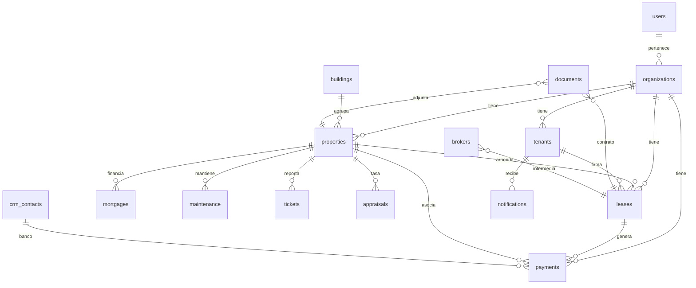

# Colecciones MongoDB — MyRent Go

Base de datos: `myrent` (configurable vía `MONGODB_DATABASE`).

MyRent Go es **multi-tenant**: la mayoría de las colecciones de negocio incluyen `organization_id` para aislar los datos de cada organización. Las excepciones son `users` (global) y `refresh_tokens` (ligados al usuario).

---

## Resumen rápido

| Colección | Módulo principal | Visibilidad | Estado en código |
|-----------|------------------|-------------|------------------|
| `users` | Autenticación / Configuración | Mixto (login visible; datos sensibles internos) | Activa |
| `organizations` | Autenticación / Multiempresa | Mixto | Activa |
| `properties` | Propiedades | Usuario | Activa |
| `buildings` | Propiedades (edificios) | Usuario (planificado) | Sin API — modelo e índices listos |
| `tenants` | Arrendatarios | Usuario | Activa |
| `leases` | Arriendos | Usuario | Activa |
| `brokers` | CRM / Arriendos | Usuario (planificado) | Sin API — modelo e índices listos |
| `payments` | Pagos, Dividendos, Dashboard | Usuario | Activa |
| `mortgages` | Finanzas | Usuario | Activa |
| `documents` | Documentos | Usuario | Activa |
| `appraisals` | Documentos / Propiedades | Usuario (planificado) | Sin API — solo validación al borrar documentos |
| `crm_contacts` | CRM | Usuario | Activa |
| `maintenance` | Mantenciones, Calendario | Usuario | Activa |
| `tickets` | Tickets | Usuario | Activa |
| `reminders` | Calendario | Usuario | Activa |
| `notifications` | Notificaciones | Usuario | Activa |
| `email_recipients` | Notificaciones por correo | Usuario | Activa |
| `audit_logs` | Seguridad / auditoría | Sistema (interno) | Sin implementación de escritura |
| `refresh_tokens` | Autenticación JWT | Sistema (interno) | Índices definidos; refresh no implementado |

---

## 1. `users`

**Qué almacena:** Cuentas de acceso a la aplicación: credenciales, perfil, membresía en organizaciones y preferencias de interfaz.

**Campos clave y relaciones:**

- `_id` — identificador del usuario
- `email` — único en toda la base (índice único)
- `password_hash` — contraseña hasheada con bcrypt (no se expone por API)
- `organizations[]` — lista de `{ organization_id, role }` (roles: `owner`, `admin`, `manager`, `accountant`, `viewer`)
- `mfa_enabled`, `mfa_secret` — autenticación de dos factores
- `preferences` — `theme` (claro/oscuro/sistema) y `locale` (es/en)

**Módulo:** Autenticación (`POST /api/v1/auth/login`, `register`, `GET /auth/me`) y Configuración.

**Visibilidad:** El usuario ve su perfil y preferencias. Los hashes, secretos MFA y la estructura interna son **sistema/interno**.

---

## 2. `organizations`

**Qué almacena:** Empresas o cuentas familiares que agrupan propiedades, contratos y finanzas (multiempresa).

**Campos clave y relaciones:**

- `_id` — referenciado por `organization_id` en casi todas las demás colecciones
- `name`, `tax_id`, `email`, `phone`, `logo_url`
- `settings` — moneda (`CLP`), zona horaria (`America/Santiago`), idioma, inicio de año fiscal
- `active` — organización habilitada o no

**Módulo:** Registro (se crea una organización al registrarse) y Configuración / multiempresa.

**Visibilidad:** **Mixto** — el nombre y datos de contacto son visibles para miembros; la gestión profunda es administrativa.

---

## 3. `properties`

**Qué almacena:** Inventario inmobiliario: casas, departamentos, terrenos, bodegas, oficinas y estacionamientos.

**Campos clave y relaciones:**

- `organization_id` → `organizations`
- `building_id` → `buildings` (opcional; edificio al que pertenece un departamento)
- `type` — `house`, `apartment`, `land`, `warehouse`, `office`, `parking`
- `status` — `available`, `rented`, `maintenance`, `for_sale`
- `purpose` — destino: vivir, arrendar, vacaciones, construcción, otro
- `address` — calle, comuna, ciudad, rol de propiedad, coordenadas
- `parking_property_id`, `warehouse_property_id` — vínculos entre departamento y estacionamiento/bodega
- `financials` — precio compra, valor comercial, arriendo esperado, gastos comunes, contribuciones, datos hipotecarios (`monthly_mortgage_uf`, `bank_name`, etc.)
- `photos[]` — imágenes de la propiedad

**Módulo:** Propiedades (`/properties`), Dashboard, Dividendos (propiedades con hipoteca), Calendario.

**Visibilidad:** **Usuario** — pantalla principal de gestión patrimonial.

---

## 4. `buildings`

**Qué almacena:** Edificios o condominios que agrupan varios departamentos u oficinas (nombre, dirección, pisos, comité, administración).

**Campos clave y relaciones:**

- `organization_id` → `organizations`
- `name`, `address`, `floors`, `units`
- `admin_company`, `concierge_phone`
- `committee[]` — miembros del comité de administración
- `regulations_doc`, `warranty_info` — referencias documentales

Propiedades de tipo departamento pueden apuntar aquí con `properties.building_id`.

**Módulo:** Propiedades (sub-módulo de edificios, descrito en arquitectura DDD).

**Visibilidad:** **Usuario** (cuando se implemente la API).

**Estado:** Colección con **modelo de dominio e índices**, pero **sin repositorio ni endpoints REST** en el backend actual. Puede existir en Compass por datos de prueba o migraciones futuras.

---

## 5. `tenants`

**Qué almacena:** Arrendatarios: personas que firman contratos de arriendo.

**Campos clave y relaciones:**

- `organization_id` → `organizations`
- `first_name`, `last_name`, `tax_id` (RUT)
- `contact` — email, teléfono, WhatsApp
- `address`, `guarantor` (aval con datos de contacto)
- `active` — arrendatario activo o dado de baja lógica

Relacionado con `leases.tenant_id` y `payments.tenant_id`.

**Módulo:** Arrendatarios (`/tenants`).

**Visibilidad:** **Usuario**.

---

## 6. `leases`

**Qué almacena:** Contratos de arriendo entre una propiedad y un arrendatario.

**Campos clave y relaciones:**

- `organization_id` → `organizations`
- `property_id` → `properties` (unidad principal)
- `warehouse_property_id`, `parking_property_id` → `properties` (incluidos en el mismo contrato)
- `tenant_id` → `tenants`
- `broker_id` → `brokers` (opcional; corredor del arriendo)
- `status` — `draft`, `active`, `expired`, `terminated`
- `start_date`, `end_date`
- `monthly_rent`, `deposit` — montos con moneda
- `ipc_adjustment`, `adjustment_month`, `payment_day`
- `contract_doc_id` → `documents` (PDF del contrato)
- `renewal_history[]` — historial de renovaciones con fechas, renta y `document_id`

**Módulo:** Arriendos (`/leases`), Pagos (generación automática de rentas), Dashboard, Calendario (vencimientos).

**Visibilidad:** **Usuario**.

---

## 7. `brokers`

**Qué almacena:** Corredores de propiedades vinculados a arriendos (nombre, contacto, comisión, licencia).

**Campos clave y relaciones:**

- `organization_id` → `organizations`
- `company_id` — inmobiliaria asociada (contacto CRM)
- `first_name`, `last_name`, `contact`
- `commission_rate`, `license_number`
- `active`

Referenciado desde `leases.broker_id`.

**Módulo:** CRM / Arriendos (planificado en arquitectura DDD).

**Visibilidad:** **Usuario** (cuando exista API).

**Estado:** **Sin repositorio ni API**. Modelo e índices preparados; colección posiblemente vacía o con datos legacy.

---

## 8. `payments`

**Qué almacena:** Movimientos financieros: rentas, depósitos, gastos, dividendos hipotecarios, gastos comunes e impuestos.

**Campos clave y relaciones:**

- `organization_id` → `organizations`
- `property_id` → `properties`
- `lease_id` → `leases` (rentas y depósitos)
- `tenant_id` → `tenants`
- `bank_id`, `bank_name` — banco del dividendo (vinculado a contactos CRM tipo `bank`)
- `type` — `rent`, `deposit`, `expense`, `dividend`, `common_fee`, `tax`
- `status` — `pending`, `paid`, `overdue`, `cancelled`
- `amount` — `{ amount, currency }` (CLP o UF según tipo)
- `due_date`, `paid_date`, `reference`, `notes`

**Módulo:** Pagos (`/payments`), Dividendos (`/dividends`), Finanzas, Dashboard, Calendario.

**Visibilidad:** **Usuario**.

---

## 9. `mortgages`

**Qué almacena:** Créditos hipotecarios formales asociados a una propiedad (monto, tasa, plazo, valor presente).

**Campos clave y relaciones:**

- `organization_id` → `organizations`
- `property_id` → `properties`
- `bank_id` → contacto CRM (`crm_contacts` tipo `bank`)
- `loan_amount`, `outstanding_balance`, `monthly_payment`
- `interest_rate`, `term_months`, `start_date`, `end_date`
- `present_value` — valor presente neto de cuotas restantes
- `active`

**Nota:** Los dividendos mensuales en la app usan principalmente `properties.financials.monthly_mortgage_uf`; esta colección complementa el análisis financiero detallado.

**Módulo:** Finanzas (`/mortgages`).

**Visibilidad:** **Usuario**.

---

## 10. `documents`

**Qué almacena:** Archivos adjuntos: contratos, escrituras, garantías, tasaciones, facturas, etc.

**Campos clave y relaciones:**

- `organization_id` → `organizations`
- `entity_type`, `entity_id` — entidad dueña (p. ej. `property`, `lease`, `tenant`)
- `category` — `contract`, `deed`, `certificate`, `warranty`, `id`, `invoice`, `appraisal`, `other`
- `title`, `file_name`, `mime_type`, `size_bytes`
- `file_data` / `storage_path` — contenido o ruta de almacenamiento
- `expires_at` — vencimiento (alertas en calendario)
- `uploaded_by` → `users`
- `version`, `tags[]`, `active`

**Módulo:** Documentos (`/documents`). Referenciado por arriendos y tasaciones.

**Visibilidad:** **Usuario**.

---

## 11. `appraisals`

**Qué almacena:** Tasaciones comerciales de propiedades (valor, tasador, fecha, método).

**Campos clave y relaciones:**

- `organization_id` → `organizations`
- `property_id` → `properties`
- `value` — monto tasado
- `appraiser`, `appraisal_date`, `method`
- `document_id` → `documents` (informe de tasación en PDF)

**Módulo:** Documentos / Propiedades (tasaciones también pueden guardarse como `documents` con categoría `appraisal`).

**Visibilidad:** **Usuario** (planificado).

**Estado:** Modelo e índices definidos. **No hay API CRUD**; solo se consulta al validar si un documento puede eliminarse (`DocumentRepo.IsReferenced`). Colección posiblemente vacía.

---

## 12. `crm_contacts`

**Qué almacena:** Directorio de contactos profesionales: corredores, bancos, técnicos y proveedores.

**Campos clave y relaciones:**

- `organization_id` → `organizations`
- `type` — `real_estate`, `bank`, `technician`, `supplier`, `other`
- `name`, `contact` (email, teléfono), `address`
- `notes[]` — notas con autor y fecha
- `tags[]`, `active`

Los bancos (`type: bank`) se usan al resolver `payments.bank_id` en dividendos.

**Módulo:** CRM (`/crm/contacts`).

**Visibilidad:** **Usuario**.

---

## 13. `maintenance`

**Qué almacena:** Mantenciones preventivas, correctivas o de emergencia programadas en propiedades.

**Campos clave y relaciones:**

- `organization_id` → `organizations`
- `property_id` → `properties`
- `type` — `preventive`, `corrective`, `emergency`
- `status` — `scheduled`, `in_progress`, `completed`, `cancelled`
- `title`, `description`, `scheduled_date`, `completed_date`
- `technician_id` → `crm_contacts` (tipo `technician`)
- `cost`, `recurrence_days`, `next_due_date` — mantención recurrente

**Módulo:** Mantenciones (`/maintenance`), Calendario.

**Visibilidad:** **Usuario**.

---

## 14. `tickets`

**Qué almacena:** Incidencias o solicitudes de servicio en una propiedad (reparaciones, reclamos).

**Campos clave y relaciones:**

- `organization_id` → `organizations`
- `property_id` → `properties`
- `lease_id` → `leases` (opcional)
- `title`, `description`
- `priority` — `low`, `medium`, `high`, `critical`
- `status` — `open`, `in_progress`, `resolved`, `closed`
- `reported_by`, `assigned_to` → `users`
- `comments[]` — hilo de comentarios
- `resolved_at`

**Módulo:** Tickets (`/tickets`).

**Visibilidad:** **Usuario**.

---

## 15. `reminders`

**Qué almacena:** Recordatorios programados para enviar por correo, WhatsApp o Telegram.

**Campos clave y relaciones:**

- `organization_id` → `organizations`
- `entity_type`, `entity_id` — origen del recordatorio (contrato, pago, documento, etc.)
- `title`, `message`
- `channel` — `email`, `whatsapp`, `telegram`
- `recipient` — destino (email o teléfono)
- `scheduled_at`, `status` (`pending`, `sent`, `failed`), `sent_at`

**Módulo:** Calendario y recordatorios (`/reminders`).

**Visibilidad:** **Usuario** (configuración de alertas); el envío real es **sistema**.

---

## 16. `notifications`

**Qué almacena:** Notificaciones de cobranza hacia arrendatarios (distinto de `reminders`: enfocado en morosidad y pagos).

**Campos clave y relaciones:**

- `organization_id` → `organizations`
- `tenant_id` → `tenants`
- `lease_id` → `leases` (opcional)
- `type` — `payment_due`, `payment_overdue`, `late_interest`
- `title`, `message`
- `channel` — `email`, `whatsapp`, `sms`, `manual`
- `status` — `pending`, `sent`, `failed`, `cancelled`
- `scheduled_at`, `sent_at`
- `metadata` — datos adicionales (montos, referencias)

**Módulo:** Notificaciones (`/notifications`).

**Visibilidad:** **Usuario** (gestión de avisos a arrendatarios).

---

## 16b. `email_recipients`

**Qué almacena:** Destinatarios internos (administradores, contadores, etc.) que reciben alertas por correo.

**Campos clave:**

- `organization_id` → `organizations`
- `email`, `name`, `label` (rol o etiqueta)
- `enabled` — si recibe correos
- `notification_types[]` — `payment_due`, `payment_overdue`, `late_interest`, `dividend_due`, `lease_expiring`

**Módulo:** Notificaciones por correo (`/email-recipients`, `/notifications/email/*`).

**Visibilidad:** **Usuario**.

---

## 17. `audit_logs`

**Qué almacena:** Registro de auditoría de acciones sensibles (crear, editar, eliminar, login, exportar).

**Campos clave y relaciones:**

- `organization_id` → `organizations`
- `user_id` → `users`
- `action` — `create`, `update`, `delete`, `login`, `export`
- `resource`, `resource_id` — entidad afectada (p. ej. `property`, `lease`)
- `details` — payload opcional del cambio
- `ip_address`, `user_agent`
- `created_at`

**Módulo:** Seguridad / cumplimiento (mencionado en manual técnico OWASP A09).

**Visibilidad:** **Sistema/interno** — no expuesto en la interfaz de usuario actual.

**Estado:** Modelo e índices definidos; **no hay repositorio ni escritura automática** en el backend actual. La colección puede estar vacía.

---

## 18. `refresh_tokens`

**Qué almacena:** Tokens de actualización JWT para renovar sesiones sin volver a iniciar sesión.

**Campos clave y relaciones:**

- `_id` — valor del refresh token
- `user_id` → `users`
- `expires_at` — fecha de expiración (índice TTL: documentos se eliminan automáticamente)
- `revoked` — token invalidado manualmente

**Módulo:** Autenticación (`POST /auth/login` devuelve un refresh token, pero la renovación aún no está operativa).

**Visibilidad:** **Sistema/interno** — el usuario nunca ve estos documentos.

**Estado:** Índices preparados y estructura definida en `auth.RefreshToken`, pero `JWT.Refresh()` retorna **"not implemented"**. La colección puede existir vacía en Compass.

---

## Relaciones entre colecciones

---

## Notas para administradores de base de datos

1. **Índices:** Se crean al arrancar la API con `EnsureIndexes()` (`backend/internal/infrastructure/mongodb/client.go`).
2. **Migración multi-org:** El script `cmd/seed` puede alinear `organization_id` en colecciones de negocio (`SEED_REPAIR=1`).
3. **Colecciones sin uso activo:** `buildings`, `brokers`, `appraisals`, `audit_logs` y `refresh_tokens` tienen esquema preparado pero carecen de endpoints REST completos en la versión actual.
4. **Documentación relacionada:** Ver también `docs/MANUAL_TECNICO.md` (índices resumidos) y `docs/MANUAL_USUARIO.md` (funcionalidad desde la perspectiva del usuario).
