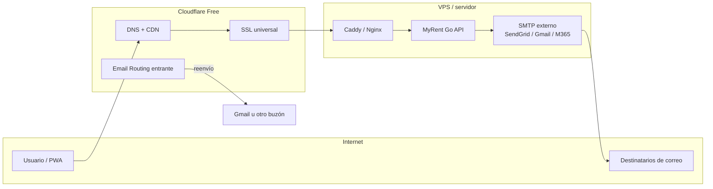

# Cloudflare — meincart.com y MyRent Go

Guía práctica para configurar el dominio **meincart.com** en el plan **Free** de Cloudflare y conectarlo con MyRent Go (DNS, SSL, correo entrante y SMTP saliente).

## Índice

| Documento | Contenido |
|-----------|-----------|
| [plan-free.md](./plan-free.md) | Qué incluye el plan gratuito, D1/R2 y límites |
| [dns.md](./dns.md) | Registros DNS, proxy naranja/gris y SSL/TLS |
| [correo.md](./correo.md) | Email Routing, SPF/DKIM/DMARC y SMTP real |
| [mailcow.md](./mailcow.md) | Servidor Mailcow self-hosted (mail.meincart.com) |
| Este archivo | Escenarios, integración con MyRent Go y referencias |

## Arquitectura recomendada



Cloudflare protege y acelera el tráfico web (HTTP/HTTPS). El **envío** de correos desde MyRent Go sale por un proveedor SMTP externo; Cloudflare Free **no** ofrece servidor SMTP saliente.

El plan Free también incluye **D1** (base SQL serverless) y **R2** (almacenamiento de objetos). MyRent Go **no los usa** hoy: la base de datos es **MongoDB** en el VPS. Detalle, casos de uso y tabla comparativa en [plan-free.md § D1 y R2](./plan-free.md#d1-y-r2-qué-son-y-si-los-necesitas).

## Configuración inicial de meincart.com

1. Inicia sesión en [dash.cloudflare.com](https://dash.cloudflare.com).
2. Verifica que **meincart.com** aparece como **Active** (estado verde). Si está en *Pending*, completa los nameservers en el registrador del dominio.
3. Revisa **DNS → Records** y **SSL/TLS** según [dns.md](./dns.md).
4. Configura correo según [correo.md](./correo.md).

### Registros DNS de referencia

Tabla resumida; el detalle y las explicaciones de proxy están en [dns.md](./dns.md).

| Tipo | Nombre | Destino / valor | Proxy |
|------|--------|-----------------|-------|
| A | `@` | IP del VPS | Proxied (naranja) |
| A | `app` | IP del VPS | Proxied |
| A | `api` | IP del VPS | Proxied |
| CNAME | `www` | `meincart.com` | Proxied |
| MX | `@` | Servidores MX de Email Routing | **DNS only** (gris) |
| TXT | `@` | SPF | DNS only |
| TXT | `_dmarc` | Política DMARC | DNS only |
| TXT | (DKIM Email Routing) | Valor que entrega Cloudflare | DNS only |

## Escenarios de despliegue

### Desarrollo local

| Aspecto | Configuración |
|---------|---------------|
| DNS | No es necesario apuntar meincart.com al localhost |
| Correo | Mailpit opcional: `docker compose -f docker-compose.mail.yml up -d` |
| SMTP en `.env` | `SMTP_HOST=localhost`, `SMTP_PORT=1025` (sin envío externo) |
| App | `FRONTEND_URL=http://localhost:4000`, API en puerto local |

Cloudflare no interviene en desarrollo. Usa Mailpit o Gmail con contraseña de aplicación para pruebas reales.

### Producción en VPS

| Aspecto | Configuración |
|---------|---------------|
| DNS | `app.meincart.com` y/o `api.meincart.com` → IP del VPS, **Proxied** |
| Origen | Caddy/Nginx con certificado válido (Let's Encrypt u origen Cloudflare) |
| SSL en Cloudflare | **Full (strict)** — ver [dns.md](./dns.md) |
| SMTP | Proveedor real (SendGrid, Gmail, M365, etc.) con `SMTP_FROM` en `@meincart.com` |
| WAF | Activar reglas gestionadas disponibles en plan Free |

Flujo: usuario → Cloudflare (CDN + SSL) → reverse proxy en VPS → contenedores MyRent Go.

### Solo dominio (sin VPS aún)

| Aspecto | Configuración |
|---------|---------------|
| DNS | Registros mínimos o parking; Email Routing puede activarse ya |
| Correo entrante | `notificaciones@meincart.com` → reenvío a Gmail |
| MyRent Go | Aún no expuesto; prepara SPF/DKIM para cuando actives SMTP |

Útil para reservar el dominio, recibir correo y dejar listos los registros TXT/MX antes del deploy.

### Subdominios

| Subdominio | Uso típico en MyRent Go | Proxy recomendado |
|------------|-------------------------|-------------------|
| `app.meincart.com` | PWA / frontend | Proxied |
| `api.meincart.com` | API REST + WebSocket | Proxied |
| `meincart.com` / `www` | Redirección o landing | Proxied |

En `.env` de producción:

```env
CORS_ORIGINS=https://app.meincart.com
FRONTEND_URL=https://app.meincart.com
```

El reverse proxy (Caddy) debe enrutar `/api` y `/ws` al backend. En Cloudflare, evita cachear rutas de API y WebSocket (ver [deploy/cloudflare/README.md](../../deploy/cloudflare/README.md)).

## Integración con MyRent Go

### Variables SMTP en `.env`

MyRent Go envía correos solo si están definidas `SMTP_HOST`, `SMTP_USER`, `SMTP_PASSWORD` y `SMTP_FROM`. La plantilla completa está en [`.env.example`](../../.env.example).

Ejemplo con dominio **meincart.com** y SendGrid:

```env
SMTP_HOST=smtp.sendgrid.net
SMTP_PORT=587
SMTP_USER=apikey
SMTP_PASSWORD=SG.xxxxxxxxxxxxxxxxxxxxx
SMTP_FROM=noreply@meincart.com
SMTP_FROM_NAME=MyRent Go
```

Ejemplo con Gmail (pruebas o bajo volumen):

```env
SMTP_HOST=smtp.gmail.com
SMTP_PORT=587
SMTP_USER=tu-correo@gmail.com
SMTP_PASSWORD=xxxx-xxxx-xxxx-xxxx
SMTP_FROM=notificaciones@meincart.com
SMTP_FROM_NAME=MyRent Go
```

> **Nota:** Si `SMTP_FROM` usa `@meincart.com`, el proveedor SMTP debe estar autorizado en SPF/DKIM de ese dominio. Ver [correo.md](./correo.md).

### Módulo de notificaciones por correo

En la aplicación:

- Ruta en el frontend: **`/email-notifications`**
- Gestión de destinatarios, tipos de notificación y envío de prueba
- El estado SMTP se consulta vía API (`/api/v1/email-recipients/smtp-status`)

Tras configurar `.env`, reinicia el backend y comprueba en **Configuración → Notificaciones por correo** que el indicador muestre *SMTP configurado*.

### Reglas importantes

1. **MX siempre en DNS only** (nube gris). Si el MX está proxied, el correo entrante falla.
2. **Email Routing** (entrante) y **SMTP externo** (saliente) son complementarios, no sustitutos.
3. Cloudflare Free no envía correos por ti; solo reenvía los que llegan a direcciones `@meincart.com` si activas Email Routing.

## Referencias

| Recurso | URL |
|---------|-----|
| Dashboard Cloudflare | https://dash.cloudflare.com |
| DNS | https://dash.cloudflare.com → dominio → **DNS** |
| SSL/TLS | https://dash.cloudflare.com → dominio → **SSL/TLS** |
| Email Routing | https://dash.cloudflare.com → dominio → **Email** → **Email Routing** |
| Documentación Email Routing | https://developers.cloudflare.com/email-routing/ |
| Planes y límites Free | https://www.cloudflare.com/plans/free/ |
| Reglas WAF/cache (MyRent Go) | [deploy/cloudflare/README.md](../../deploy/cloudflare/README.md) |
| Variables de entorno del proyecto | [`.env.example`](../../.env.example) |
| Checklist de producción | [CHECKLIST_PRODUCCION.md](../CHECKLIST_PRODUCCION.md) |

## Documentos relacionados del proyecto

- [PRODUCTION.md](../PRODUCTION.md) — índice de despliegue en producción
- [DESPLIEGUE_PRODUCCION_SUBDOMINIO.md](../DESPLIEGUE_PRODUCCION_SUBDOMINIO.md) — guía paso a paso con subdominio (VPS + Docker)
- [MANUAL_TECNICO.md](../MANUAL_TECNICO.md) — arquitectura con Cloudflare en el edge
- [MANUAL_USUARIO.md](../MANUAL_USUARIO.md) — recordatorios automáticos por correo
