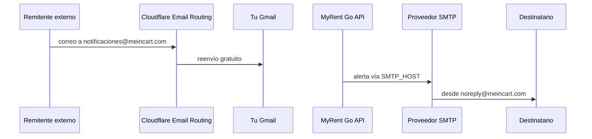

# Correo — meincart.com y MyRent Go

Cloudflare gestiona el correo **entrante** (reenvío). MyRent Go gestiona el correo **saliente** (notificaciones) mediante SMTP real.

## Dos canales distintos



| Canal | Herramienta | Coste |
|-------|-------------|-------|
| Entrante | Cloudflare Email Routing o Mailcow | Gratis / VPS |
| Saliente (app) | Gmail / SendGrid / M365 / **Mailcow** / otro SMTP | Según proveedor |

Cloudflare Free **no** incluye servidor SMTP saliente. No intentes usar Email Routing para enviar correos desde MyRent Go.

## Email Routing (entrante, gratuito)

### Activación

1. En [dash.cloudflare.com](https://dash.cloudflare.com) → **meincart.com** → **Email** → **Email Routing**.
2. Sigue el asistente; Cloudflare creará registros **MX** y **TXT** (deben quedar en **DNS only**).
3. Crea una dirección personalizada, por ejemplo:
   - `notificaciones@meincart.com` → reenvío a `tu-correo@gmail.com`
   - `dmarc@meincart.com` → reenvío para informes DMARC

### Ejemplo de uso

- Publicas `contacto@meincart.com` en documentación; los mensajes llegan a tu Gmail.
- Recibes informes DMARC en una bandeja que ya revisas.

Email Routing **no** sustituye las variables `SMTP_*` del backend.

## SMTP saliente para MyRent Go

**Camino por defecto (día 1):** proveedor gratuito (**Brevo**, **SendGrid** o **Gmail**). Mailcow es opcional. Checklist: [DIA1_PRODUCCION_APP_MEINCART.md](../DIA1_PRODUCCION_APP_MEINCART.md).

El backend lee la configuración desde `.env`. Referencia: [`.env.production.example`](../../.env.production.example).

### Variables requeridas

| Variable | Descripción |
|----------|-------------|
| `SMTP_HOST` | Host del proveedor (ej. `smtp-relay.brevo.com`) |
| `SMTP_PORT` | Puerto TLS (normalmente `587`) |
| `SMTP_USER` | Usuario SMTP |
| `SMTP_PASSWORD` | Contraseña o API key |
| `SMTP_FROM` | Dirección remitente visible (`noreply@meincart.com`) |
| `SMTP_FROM_NAME` | Nombre amigable (ej. `MyRent Go`) |

El cliente SMTP considera la configuración **completa** solo si existen host, user, password y from. Si falta alguna, los correos se omiten y la UI mostrará *SMTP no configurado*.

### Ejemplo Brevo (recomendado día 1)

```env
SMTP_HOST=smtp-relay.brevo.com
SMTP_PORT=587
SMTP_USER=1@smtp-brevo.com
SMTP_PASSWORD=<desde brevo>
SMTP_FROM=noreply@meincart.com
SMTP_FROM_NAME=Rent
```

SPF (unifica un solo TXT `@`, **DNS only**):

```text
v=spf1 include:spf.brevo.com include:_spf.mx.cloudflare.net ~all
```

Copia también los TXT DKIM que muestre el panel de Brevo al verificar `meincart.com`.

### Ejemplo SendGrid

```env
SMTP_HOST=smtp.sendgrid.net
SMTP_PORT=587
SMTP_USER=apikey
SMTP_PASSWORD=SG.xxxxxxxxxxxxxxxxxxxxx
SMTP_FROM=noreply@meincart.com
SMTP_FROM_NAME=MyRent Go
```

### Ejemplo Gmail (bajo volumen)

Requiere verificación en 2 pasos y [contraseña de aplicación](https://myaccount.google.com/apppasswords).
Sin Google Workspace, usa tu Gmail como `SMTP_FROM` (no `noreply@meincart.com`).

```env
SMTP_HOST=smtp.gmail.com
SMTP_PORT=587
SMTP_USER=tu-correo@gmail.com
SMTP_PASSWORD=xxxx-xxxx-xxxx-xxxx
SMTP_FROM=tu-correo@gmail.com
SMTP_FROM_NAME=MyRent Go
```

### Desarrollo local sin SMTP real (Mailpit)

```env
SMTP_HOST=localhost
SMTP_PORT=1025
SMTP_USER=
SMTP_PASSWORD=
SMTP_FROM=noreply@myrent.local
```

Levantar Mailpit: `docker compose -f docker-compose.mail.yml up -d` — bandeja en http://localhost:8025.

## Mailcow (opcional, futuro)

**No es el camino del día 1.** Solo si más adelante quieres correo self-hosted en otro host (`mail.meincart.com`).

Servidor de correo completo en un VPS dedicado. Incluye SMTP saliente, buzones `@meincart.com`, panel admin y webmail.

| Aspecto | Detalle |
|---------|---------|
| Instalación | `./scripts/setup-mailcow.sh` o `./myrent.sh mailcow-setup` |
| Arranque | `./myrent.sh mailcow-start` (requiere `mailcow/` generado) |
| Documentación | [mailcow.md](./mailcow.md) |
| Desarrollo local | Usa **Mailpit**, no Mailcow (conflicto de puertos 80/443) |

Ejemplo `.env` con Mailcow:

```env
SMTP_HOST=mail.meincart.com
SMTP_PORT=587
SMTP_USER=noreply@meincart.com
SMTP_PASSWORD=contraseña-del-buzón
SMTP_FROM=noreply@meincart.com
SMTP_FROM_NAME=MyRent Go
```

### SPF con Mailcow

```text
TXT @  v=spf1 mx a:mail.meincart.com ~all
```

DKIM: copia el registro desde el panel Mailcow → Configuración → DKIM (`dkim._domainkey`).

## Autenticación de correo (SPF, DKIM, DMARC)

Configura estos registros **TXT** en DNS (normalmente **DNS only**) para mejorar entregabilidad cuando `SMTP_FROM` usa `@meincart.com`.

### Solo Email Routing (entrante)

Cloudflare suele proponer automáticamente:

```text
TXT @  v=spf1 include:_spf.mx.cloudflare.net ~all
```

### SMTP saliente con Brevo

```text
TXT @  v=spf1 include:spf.brevo.com include:_spf.mx.cloudflare.net ~all
```

### SMTP saliente con SendGrid

Añade o combina en un único SPF (solo puede haber un registro SPF por host; unifica includes):

```text
TXT @  v=spf1 include:sendgrid.net include:_spf.mx.cloudflare.net ~all
```

DKIM (SendGrid te da el selector y valor):

```text
TXT s1._domainkey  v=DKIM1; k=rsa; p=MIIBIjANBgkqhkiG9w0BAQEFAAOCAQ8A...
```

DMARC (recomendado empezar en modo monitor):

```text
TXT _dmarc  v=DMARC1; p=none; rua=mailto:dmarc@meincart.com; pct=100; adkim=r; aspf=r
```

Cuando la entrega sea estable, puedes endurecer a `p=quarantine` o `p=reject`.

### SMTP saliente con Gmail / Google Workspace

```text
TXT @  v=spf1 include:_spf.google.com ~all
```

DKIM se configura en la consola de administración de Google (registro `google._domainkey`).

## MX y proxy — recordatorio

| Registro | Proxy en Cloudflare |
|----------|---------------------|
| MX | **DNS only** (gris) |
| TXT SPF/DKIM/DMARC | **DNS only** (gris) |

## Probar desde MyRent Go

1. Completa `.env` y reinicia el backend.
2. Inicia sesión en la app y abre **`/email-notifications`**.
3. Verifica que el estado indique *SMTP configurado*.
4. Añade un destinatario de prueba y usa **Probar formatos** (o correo de prueba).

La API expone el estado en `GET /api/v1/email-recipients/smtp-status`.

## Referencias

| Tema | Enlace |
|------|--------|
| Checklist día 1 | [DIA1_PRODUCCION_APP_MEINCART.md](../DIA1_PRODUCCION_APP_MEINCART.md) |
| Email Routing | https://developers.cloudflare.com/email-routing/ |
| Configurar destinos | https://developers.cloudflare.com/email-routing/setup/email-routing-addresses/ |
| Variables SMTP producción | [`.env.production.example`](../../.env.production.example) |
| Mailcow (opcional) | [mailcow.md](./mailcow.md) |
| DNS y proxy | [dns.md](./dns.md) |

## Volver al índice

[README.md](./README.md)
