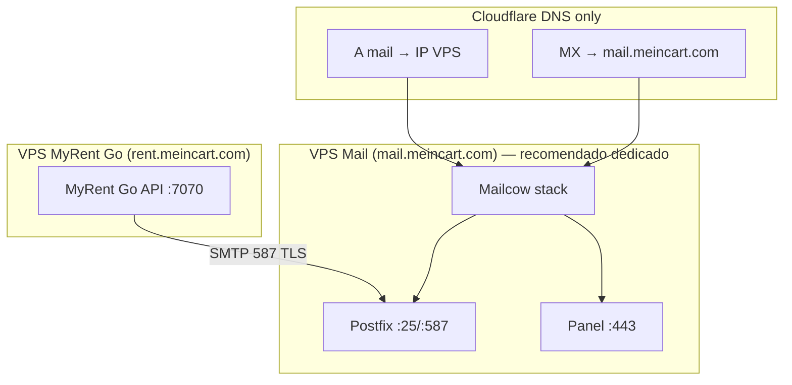

# Mailcow — correo self-hosted para meincart.com

Servidor de correo completo ([mailcow-dockerized](https://github.com/mailcow/mailcow-dockerized)). **Opcional / futuro** — el día 1 usa SMTP gratuito (Brevo/SendGrid/Gmail); ver [correo.md](./correo.md) y [DIA1](../DIA1_PRODUCCION_APP_MEINCART.md).

## Cuándo usar Mailcow

| Escenario | Recomendación |
|-----------|---------------|
| Día 1 / desarrollo | Mailpit local o **Brevo / SendGrid / Gmail** |
| Producción, bajo volumen | SMTP free (no Mailcow) |
| Control total del dominio más adelante | **Mailcow** en VPS dedicado (otro host, no pelear 80/443 con la app) |

Mailcow **no** sustituye Cloudflare Email Routing para correo entrante genérico; puedes combinar Routing (alias → Gmail) con Mailcow (buzones + SMTP) cuando lo instales.

## Arquitectura recomendada



**No ejecutes Mailcow en la misma máquina que el stack de desarrollo de MyRent Go** si comparten puertos 80/443. En producción, separa app y correo en hosts distintos o usa reverse proxy con puertos alternativos en `mailcow.conf` (`HTTP_PORT`, `HTTPS_PORT`).

## Puertos requeridos

| Puerto | Protocolo | Uso |
|--------|-----------|-----|
| 25 | SMTP | Correo entrante (MX) |
| 587 | SMTP submission | **MyRent Go envía aquí** |
| 465 | SMTPS | Clientes legacy |
| 80 | HTTP | Let's Encrypt / redirección |
| 443 | HTTPS | Panel admin, SOGo webmail |
| 143 / 993 | IMAP / IMAPS | Clientes de correo |
| 110 / 995 | POP / POPS | Clientes legacy |
| 4190 | ManageSieve | Filtros |

### Conflictos con MyRent Go (desarrollo)

| Servicio MyRent | Puerto | Conflicto con Mailcow |
|-----------------|--------|------------------------|
| API | 7070 | No |
| Frontend Docker | 3000 | No |
| Frontend dev (Vite) | 4000 / 5173 | No |
| MongoDB | 27017 | No |
| Mailpit | 1025, 8025 | No |
| — | **80, 443** | **Sí** — panel Mailcow |
| — | **25, 587, 465** | **Sí** — si Mailpit/SMTP local ocupa 587 |

## Prerrequisitos

1. **VPS** con Docker y Docker Compose v2 (mín. 6 GB RAM, 20 GB disco; [requisitos oficiales](https://docs.mailcow.email/getstarted/install/)).
2. **FQDN** `mail.meincart.com` apuntando a la IP del VPS (**DNS only** en Cloudflare).
3. Puertos **25, 80, 443, 587, 465** abiertos en firewall del proveedor y del SO.
4. PTR/rDNS del VPS configurado como `mail.meincart.com` (mejora entregabilidad).
5. Dominio **meincart.com** activo en Cloudflare.

## Instalación

Desde la raíz del proyecto:

```bash
# Instalación interactiva (clona en mailcow/, genera mailcow.conf)
./scripts/setup-mailcow.sh

# Personalizar hostname o zona horaria
MAILCOW_HOSTNAME=mail.meincart.com MAILCOW_TZ=America/Caracas ./scripts/setup-mailcow.sh
```

O desde el menú: `./myrent.sh` → **Base de datos y servicios** → **Mailcow — instalar**.

El directorio `mailcow/` es un clon de [mailcow-dockerized](https://github.com/mailcow/mailcow-dockerized) y **no se versiona** (contiene datos, certificados y secretos).

### Arranque y parada

```bash
cd mailcow
docker compose pull
docker compose up -d

# Parar
docker compose down
```

Atajos CLI:

```bash
./myrent.sh mailcow-start
./myrent.sh mailcow-stop
./myrent.sh mailcow-status
```

### Primer acceso al panel

- URL: `https://mail.meincart.com/admin`
- Usuario por defecto: `admin`
- Contraseña por defecto: `moohoo` — **cámbiala inmediatamente**

En el panel:

1. **Correo → Buzones** — crea `noreply@meincart.com` (o el remitente que usará MyRent Go).
2. **Sistema → Configuración → DKIM** — copia el registro DNS.
3. Opcional: desactiva buzones que no necesites; configura cuotas.

## DNS en Cloudflare (meincart.com)

Todos los registros de correo deben estar en **DNS only** (nube gris). Cloudflare **no** debe hacer proxy de tráfico SMTP/IMAP.

| Tipo | Nombre | Contenido | Proxy |
|------|--------|-----------|-------|
| A | `mail` | IP del VPS Mailcow | DNS only |
| MX | `@` | `mail.meincart.com` (prio 10) | DNS only |
| TXT | `@` | `v=spf1 mx a:mail.meincart.com ~all` | DNS only |
| TXT | `dkim._domainkey` | *(valor del panel Mailcow)* | DNS only |
| TXT | `_dmarc` | `v=DMARC1; p=none; rua=mailto:dmarc@meincart.com` | DNS only |

### Convivencia con Email Routing (entrante)

Si usas [Email Routing](./correo.md) para reenviar `notificaciones@` → Gmail:

- El MX de Cloudflare Email Routing y el MX hacia Mailcow **no pueden coexistir** en `@` con prioridades distintas para el mismo flujo sin planificar subdominios.
- Opciones habituales:
  - **Solo Mailcow** para `@` (MX → mail.meincart.com) y buzones en Mailcow.
  - **Solo Email Routing** para entrante + SMTP externo/Mailcow solo para salida (SPF/DKIM alineados con el remitente).

Para MyRent Go solo necesitas **SMTP saliente** hacia Mailcow; el MX entrante puede quedar en Mailcow si quieres recibir correo en `@meincart.com`.

## MyRent Go — variables SMTP

En el `.env` del servidor donde corre la **API** (no en el VPS de Mailcow, salvo que sea el mismo host):

```env
SMTP_HOST=mail.meincart.com
SMTP_PORT=587
SMTP_USER=noreply@meincart.com
SMTP_PASSWORD=contraseña-del-buzón-en-mailcow
SMTP_FROM=noreply@meincart.com
SMTP_FROM_NAME=MyRent Go
```

Si la API corre en Docker en el mismo VPS que Mailcow, usa el hostname interno de la red Docker de Mailcow solo si sabes enrutar entre stacks; lo habitual es `mail.meincart.com` o la IP del host en el puerto 587.

### Verificación

1. Reinicia la API tras cambiar `.env`.
2. Inicia sesión en MyRent Go → **`/email-notifications`**.
3. Confirma *SMTP configurado* y envía un correo de prueba.
4. Revisa en Mailcow → **Registros** / **Cuarentena** si no llega.

## Seguridad y mantenimiento

- Actualiza Mailcow periódicamente: `cd mailcow && git pull && docker compose pull && docker compose up -d`.
- No subas `mailcow/` ni `mailcow.conf` al repositorio Git.
- Restringe el panel admin por IP o VPN si es posible.
- Monitoriza listas RBL y reputación del IP del VPS.
- Configura backups del volumen `mailcow/` (directorio `mailcow/` completo).

## Referencias

| Tema | Enlace |
|------|--------|
| Instalación oficial | https://docs.mailcow.email/getstarted/install/ |
| DNS / reverse DNS | https://docs.mailcow.email/post_installation/reverse-dns/ |
| SMTP relay / submission | https://docs.mailcow.email/post_installation/submission/ |
| Correo general del proyecto | [correo.md](./correo.md) |
| Mailpit (solo dev) | [correo.md § Mailpit](./correo.md#desarrollo-local-sin-smtp-real-mailpit) |
| Setup script | [`scripts/setup-mailcow.sh`](../../scripts/setup-mailcow.sh) |

## Volver al índice

[README.md](./README.md)
