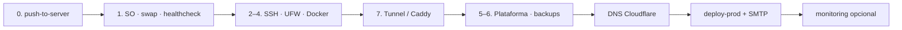

# Índice de documentación — producción y host

Mapa rápido de guías. El kit [`ubuntu/`](../ubuntu/README.md) es **genérico**; el resto describe el producto **MyRent Go** (`rent.meincart.com`).

## Flujo recomendado

| Orden | Documento | Contenido |
|-------|-----------|-----------|
| 0 | [ubuntu/README.md](../ubuntu/README.md) | ZIP→SSH, menú SO/seguridad/firewall/Docker/**borde**/plataforma |
| 0b | [ubuntu/docs/CATALOGO.md](../ubuntu/docs/CATALOGO.md) | Redis, MinIO, Vault, Tunnel, Caddy, exporters, etc. |
| 0c | [bash/README.md](./bash/README.md) | Scripts bash: push, prod-menu, migrate-mongo, backups, paso a paso |
| 1 | [DIA1_PRODUCCION_APP_MEINCART.md](./DIA1_PRODUCCION_APP_MEINCART.md) | Checklist día 1 MyRent Go |
| 2 | [DESPLIEGUE_PRODUCCION_SUBDOMINIO.md](./DESPLIEGUE_PRODUCCION_SUBDOMINIO.md) | Guía larga subdominio + Caddy |
| 3 | [PRODUCTION.md](./PRODUCTION.md) | Variables, seed, backups, métricas |
| 4 | [CHECKLIST_PRODUCCION.md](./CHECKLIST_PRODUCCION.md) | Checklist seguridad / ops |
| 5 | [Cloudflare/README.md](./Cloudflare/README.md) | DNS, SSL, Email Routing, SMTP |
| 6 | [OBSERVABILIDAD_RESTIC.md](./OBSERVABILIDAD_RESTIC.md) | Prometheus/Grafana/Restic **de MyRent Go** |
| 6b | [deploy/platform/README.md](../deploy/platform/README.md) | Compose monitoring acoplado a `myrentgo-prod` |

## Dos capas de “plataforma”

| Capa | Ruta | Alcance |
|------|------|---------|
| **Genérica** | `ubuntu/platform/*` | Multi-app: Redis, MinIO, Vault, métricas, BD, Caddy, Tunnel, exporters, Restic |
| **MyRent Go** | `deploy/platform/` + `docker-compose.prod.yml` | App + monitoring en red `myrentgo-prod` |

Usa la genérica para preparar el host y servicios compartidos. Usa `deploy/platform/` si solo despliegas MyRent Go y quieres el dashboard/alertas ya cableados a la API.
