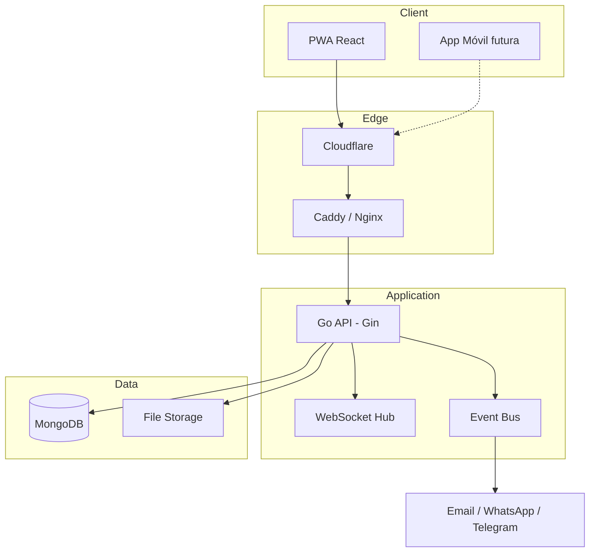

# Manual Técnico — MyRent Go

## Arquitectura



## Capas (Clean Architecture)

| Capa | Ubicación | Responsabilidad |
|------|-----------|-----------------|
| Domain | `internal/domain/` | Entidades, value objects, eventos de dominio |
| Application | `internal/application/` | CQRS handlers, casos de uso, event bus |
| Infrastructure | `internal/infrastructure/` | MongoDB, JWT, notificaciones |
| Interfaces | `internal/interfaces/` | HTTP REST, WebSocket, middleware |

## Bounded Contexts (DDD)

- **Identity**: users, organizations, RBAC, MFA, audit
- **Property**: properties, buildings, appraisals
- **Leasing**: leases, tenants, contracts
- **Finance**: payments, mortgages, cash flow, profitability
- **Operations**: maintenance, tickets, reminders
- **CRM**: brokers, contacts (banks, suppliers)
- **Documents**: file storage, versioning, expiration

## CQRS

- **Commands**: mutaciones (CreateProperty, CreateLease, Register)
- **Queries**: lecturas (ListProperties, Dashboard)
- Bus en `internal/application/cqrs/`

## Event Bus

Eventos de dominio publicados de forma asíncrona:
- `property.created` → auditoría, notificaciones
- `lease.expiring` → recordatorios
- `payment.overdue` → alertas

## MongoDB — Colecciones e Índices

| Colección | Índices principales |
|-----------|---------------------|
| users | email (unique) |
| organizations | tax_id, active |
| properties | org_id+status, org_id+building_id, commune |
| tenants | org_id, org_id+tax_id |
| leases | org_id+status, property_id, end_date |
| payments | org_id+status, due_date, org_id+due_date+status |
| mortgages | property_id, bank_id |
| documents | org_id+entity_type+entity_id, expires_at |
| maintenance | scheduled_date, next_due_date |
| tickets | org_id+status, priority |
| audit_logs | org_id+created_at |
| refresh_tokens | TTL en expires_at |

## API REST

Base: `/api/v1`

| Método | Ruta | Auth | Descripción |
|--------|------|------|-------------|
| POST | /auth/register | No | Registro + org |
| POST | /auth/login | No | Login JWT |
| GET | /auth/me | Sí | Usuario actual |
| GET | /dashboard | Sí | Dashboard financiero |
| GET/POST | /properties | Sí | CRUD propiedades |
| GET | /ws?org_id= | Sí* | WebSocket eventos |

## WebSocket

Conexión: `ws://host/ws?org_id={id}&user_id={id}`

Mensajes:
```json
{ "type": "payment.received", "payload": { ... } }
{ "type": "lease.expiring", "payload": { ... } }
```

## Seguridad (OWASP Top 10)

- **A01 Broken Access Control**: RBAC por organización
- **A02 Cryptographic Failures**: bcrypt, JWT HS256, HTTPS
- **A03 Injection**: validación Gin, BSON tipado
- **A04 Insecure Design**: multi-tenant por org_id
- **A05 Security Misconfiguration**: headers, CSP
- **A07 Auth Failures**: MFA opcional, rate limit login
- **A09 Logging**: audit_logs collection

## Variables de entorno

Ver `.env.example`

## Despliegue

```bash
cp .env.example .env
# Editar JWT_SECRET y dominios
./scripts/deploy.sh production
```

## Tests

```bash
make test
```

## Preparación móvil

API REST versionada (`/api/v1`), JWT estándar, respuestas JSON consistentes. El frontend PWA sirve como base; la app nativa consumirá los mismos endpoints.
