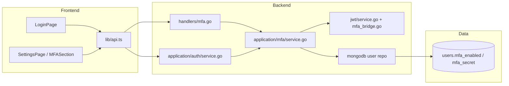
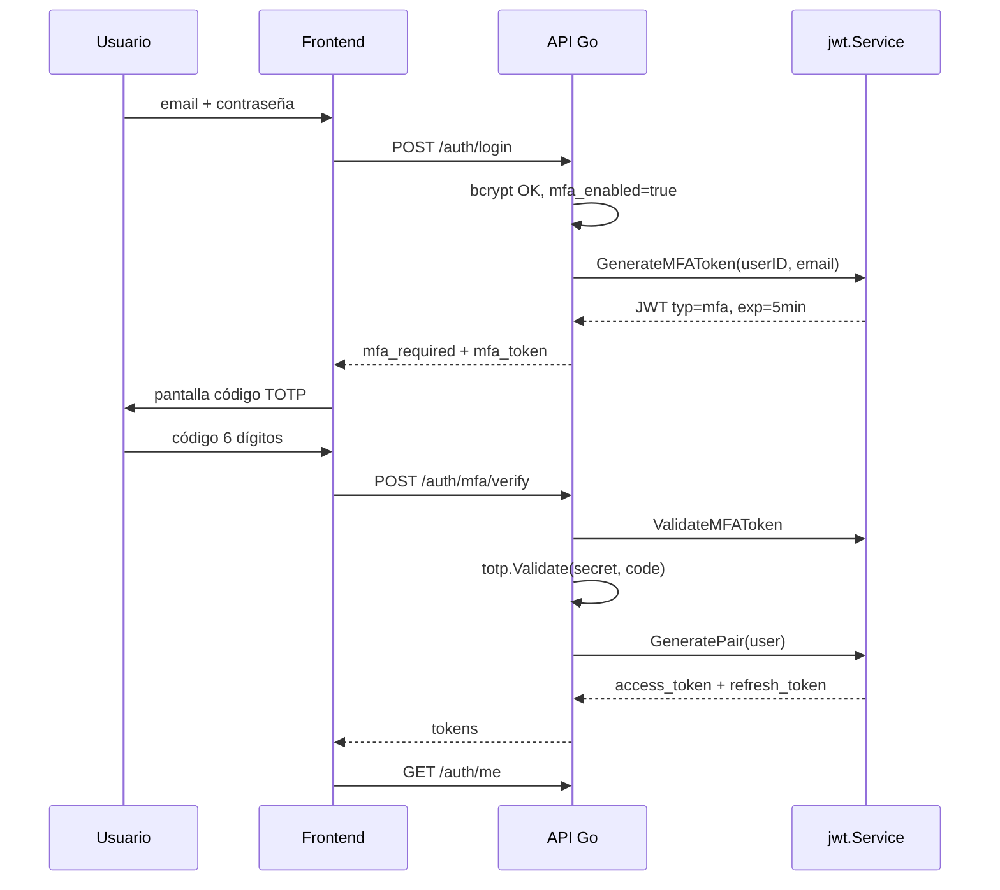

# Autenticación de dos factores (MFA) — MyRent Go

Documentación funcional y técnica del MFA basado en **TOTP** (Time-based One-Time Password). Complementa el [Manual de usuario](./MANUAL_USUARIO.md) y el [Manual técnico](./MANUAL_TECNICO.md).

---

## Qué es y para qué sirve

MyRent Go implementa **MFA opcional por usuario** mediante códigos TOTP de 6 dígitos, compatibles con aplicaciones estándar como **Google Authenticator**, **Microsoft Authenticator**, **Authy** o **1Password**.

Tras activar MFA en Configuración, el inicio de sesión pasa a ser de **dos pasos**:

1. Email y contraseña (como siempre).
2. Código de 6 dígitos generado por la app autenticadora (válido ~30 segundos).

El secreto TOTP se genera en el servidor y se vincula a la cuenta del usuario. No se envía por correo ni depende de SMS.

---

## Flujo funcional

### Activar MFA (Configuración)

Ruta en la UI: **Configuración → Seguridad** (`SettingsPage` + componente `MFASection`).

| Paso | Acción del usuario | Qué ocurre en el sistema |
|------|--------------------|--------------------------|
| 1 | Pulsa **Activar** | `POST /api/v1/auth/mfa/setup` genera un secreto TOTP y devuelve `secret` + `otpauth_url` |
| 2 | Escanea el QR o copia el secreto manualmente | El secreto queda guardado en MongoDB (`mfa_secret`), pero `mfa_enabled` sigue en `false` |
| 3 | Ingresa el código de 6 dígitos y confirma | `POST /api/v1/auth/mfa/enable` valida el TOTP y pone `mfa_enabled: true` |

Si el usuario cancela el asistente en el frontend sin confirmar, el secreto pendiente **permanece en la base** hasta que vuelva a iniciar setup (se sobrescribe) o desactive MFA más adelante.

### Inicio de sesión con MFA

| Paso | Acción del usuario | Qué ocurre en el sistema |
|------|--------------------|--------------------------|
| 1 | Ingresa email y contraseña | `POST /api/v1/auth/login` valida credenciales |
| 2 | Si `mfa_enabled` es `true` | La API responde `{ "mfa_required": true, "mfa_token": "..." }` **sin** emitir JWT de acceso |
| 3 | Ingresa el código TOTP | `POST /api/v1/auth/mfa/verify` valida `mfa_token` + código y devuelve `access_token` / `refresh_token` |
| 4 | Acceso a la aplicación | El frontend guarda el token y carga el perfil (`GET /api/v1/auth/me`) |

El `mfa_token` expira en **5 minutos**. Si caduca, el usuario debe volver al paso de credenciales.

### Desactivar MFA

Solo disponible con MFA ya activo. Requiere **contraseña actual + código TOTP**:

1. El usuario completa ambos campos en Configuración → Seguridad.
2. `POST /api/v1/auth/mfa/disable` valida contraseña (bcrypt) y TOTP.
3. El sistema pone `mfa_enabled: false` y borra `mfa_secret`.

---

## Implementación técnica

### Arquitectura por capas



### Archivos principales

| Área | Archivo | Responsabilidad |
|------|---------|-----------------|
| Dominio | `backend/internal/domain/user/user.go` | Campos `MFAEnabled`, `MFASecret` (el secreto no se serializa al JSON de API) |
| Aplicación | `backend/internal/application/mfa/service.go` | Setup, enable, disable, verify login, validación TOTP |
| Auth | `backend/internal/application/auth/service.go` | Tras login exitoso, si `MFAEnabled`, emite desafío en lugar de JWT |
| HTTP | `backend/internal/interfaces/http/handlers/mfa.go` | Endpoints REST y mensajes de error en español |
| HTTP | `backend/internal/interfaces/http/handlers/auth.go` | Login con respuesta `mfa_required` / `mfa_token`; `/me` expone `mfa_enabled` |
| JWT | `backend/internal/infrastructure/jwt/service.go` | Generación y validación del `mfa_token` (TTL 5 min, claim `typ: "mfa"`) |
| JWT | `backend/internal/infrastructure/jwt/mfa_bridge.go` | Adaptador del servicio JWT para la capa MFA |
| Wiring | `backend/cmd/api/main.go` | Instancia `mfaSvc`, `mfaBridge`, conecta auth ↔ MFA |
| Rutas | `backend/internal/interfaces/http/router.go` | Registro de endpoints bajo `/api/v1/auth/mfa/*` |
| Config | `backend/internal/config/config.go` | `MFA_ENABLED` (default `true`) |
| Frontend | `frontend/src/components/MFASection.tsx` | QR (`qrcode.react`), activar/desactivar |
| Frontend | `frontend/src/pages/LoginPage.tsx` | Paso `credentials` → `mfa` |
| Frontend | `frontend/src/stores/index.ts` | `login()` detecta MFA; `completeMfaLogin()` llama a verify |
| Frontend | `frontend/src/lib/api.ts` | Cliente HTTP para los cuatro endpoints MFA |
| Logs | `backend/internal/infrastructure/syslog/events.go` | Eventos: setup, enable, disable, verify ok/fail, login MFA required |

### Rutas API

Prefijo base: `/api/v1/auth`

| Método | Ruta | Auth | Body | Respuesta |
|--------|------|------|------|-----------|
| `POST` | `/login` | No | `{ email, password }` | Tokens **o** `{ mfa_required, mfa_token }` |
| `POST` | `/mfa/setup` | JWT | — | `{ secret, otpauth_url }` |
| `POST` | `/mfa/enable` | JWT | `{ code }` (6 dígitos) | `{ message }` |
| `POST` | `/mfa/disable` | JWT | `{ password, code }` | `{ message }` |
| `POST` | `/mfa/verify` | No | `{ mfa_token, code }` | `{ access_token, refresh_token, expires_in }` |
| `GET` | `/me` | JWT | — | Perfil con `mfa_enabled` |

### Modelo de datos (MongoDB)

Colección `users` — ver también [COLECCIONES_MONGODB.md](./COLECCIONES_MONGODB.md).

| Campo BSON | Tipo | Descripción |
|------------|------|-------------|
| `mfa_enabled` | `bool` | MFA activo para este usuario |
| `mfa_secret` | `string` | Secreto TOTP en base32; **no** se expone en respuestas JSON de la API |

Estados típicos:

- Sin MFA: `mfa_enabled: false`, sin `mfa_secret` (o vacío).
- Setup pendiente: `mfa_enabled: false`, `mfa_secret` presente.
- MFA activo: `mfa_enabled: true`, `mfa_secret` presente.

### Librerías

| Componente | Librería | Uso |
|------------|----------|-----|
| Backend TOTP | [`github.com/pquerna/otp`](https://github.com/pquerna/otp) (`totp` v1.5.0) | Generar secreto, URL `otpauth://`, validar códigos |
| Backend JWT | `github.com/golang-jwt/jwt/v5` | `mfa_token` firmado con HS256 |
| Backend contraseña | `golang.org/x/crypto/bcrypt` | Verificación al desactivar MFA |
| Frontend QR | `qrcode.react` | Render del QR a partir de `otpauth_url` |

Parámetros TOTP configurados en código:

- Emisor (`Issuer`): `APP_NAME` (default **MyRent Go**)
- Cuenta (`AccountName`): email del usuario
- Período: 30 s
- Dígitos: 6
- Algoritmo: SHA-1 (estándar compatible con la mayoría de apps autenticadoras)

### Flujo del `mfa_token` (JWT puente)

El `mfa_token` **no** es un JWT de sesión. Es un token de un solo uso con propósito limitado:



Claims del `mfa_token`:

- `uid` — ID del usuario
- `email` — email
- `typ` — siempre `"mfa"`
- `exp` — 5 minutos desde la emisión
- Firmado con `JWT_SECRET` (misma clave que los access tokens)

---

## Configuración

### Variables de entorno

| Variable | Obligatoria | Default | Efecto en MFA |
|----------|-------------|---------|---------------|
| `MFA_ENABLED` | No | `true` | Si `false`, **setup** y **enable** devuelven 403. Login y verify siguen funcionando para usuarios que ya tenían MFA activo |
| `JWT_SECRET` | Sí (prod) | placeholder inseguro | Firma y validación del `mfa_token` y access tokens |
| `JWT_ACCESS_TTL` | No | `15m` | TTL del access token tras verify MFA |
| `JWT_REFRESH_TTL` | No | `168h` | TTL del refresh token |
| `JWT_ISSUER` | No | `my-rent-go` | Issuer del JWT (no del TOTP) |
| `APP_NAME` | No | `MyRent Go` | Nombre que aparece en la app autenticadora (issuer TOTP) |
| `MONGODB_URI` / `MONGODB_DATABASE` | Sí | `localhost` / `myrent` | Persistencia de `mfa_enabled` y `mfa_secret` |

`FRONTEND_URL` no interviene directamente en MFA; se usa en otros flujos (correo, enlaces). No hace falta configurarla solo por MFA.

Ejemplo mínimo en `.env` (ver `.env.example`):

```env
JWT_SECRET=CHANGE-ME-use-openssl-rand-base64-32
MFA_ENABLED=true
MONGODB_URI=mongodb://localhost:27017
MONGODB_DATABASE=myrent
```

### Docker

- **Desarrollo** (`docker-compose.yml`): no define `MFA_ENABLED`; hereda el default `true` del backend si la variable no se pasa.
- **Producción** (`docker-compose.prod.yml`): fija `MFA_ENABLED: "true"`.

No se requiere infraestructura adicional (Redis, colas, servicio externo de MFA). Todo corre en el proceso API + MongoDB.

### Checklist de producción

En [CHECKLIST_PRODUCCION.md](./CHECKLIST_PRODUCCION.md) se recomienda tener MFA habilitado para administradores. Hoy es **responsabilidad del usuario** activarlo en Configuración; no hay política automática por rol u organización.

---

## Cómo probar

### Requisitos

- Backend y frontend en ejecución (p. ej. `./myrent.sh` o `docker compose up`).
- MongoDB accesible.
- `MFA_ENABLED=true`.
- App autenticadora en el móvil (Google Authenticator u otra compatible TOTP).

### Usuario de prueba

Credenciales por defecto del seed/README:

| Campo | Valor |
|-------|-------|
| Email | `admin` o `admin@myrent.local` |
| Contraseña | `admin123` |

### Pasos recomendados

1. Inicia sesión con el admin y ve a **Configuración → Seguridad**.
2. Activa MFA, escanea el QR con la app autenticadora.
3. Confirma con el código de 6 dígitos.
4. Cierra sesión e inicia de nuevo: debe aparecer el segundo paso (código TOTP).
5. Opcional: desactiva MFA con contraseña `admin123` + código actual.

### Mailpit / correo

MFA **no usa correo**. Mailpit no interviene en este flujo. Los eventos MFA sí aparecen en los logs del sistema (`mfa enabled`, `mfa verify success`, etc.) visibles en el panel de monitoreo si está habilitado.

### Prueba vía API (curl)

```bash
# 1. Login
curl -s -X POST http://localhost:7070/api/v1/auth/login \
  -H 'Content-Type: application/json' \
  -d '{"email":"admin","password":"admin123"}'

# Si MFA activo → { "mfa_required": true, "mfa_token": "..." }

# 2. Verify (sustituir token y código)
curl -s -X POST http://localhost:7070/api/v1/auth/mfa/verify \
  -H 'Content-Type: application/json' \
  -d '{"mfa_token":"TOKEN","code":"123456"}'
```

Para setup/enable/disable hace falta el `Authorization: Bearer <access_token>` de una sesión **sin** MFA pendiente o recién obtenida.

---

## Seguridad

| Aspecto | Comportamiento actual |
|---------|----------------------|
| Almacenamiento del secreto | En MongoDB como texto (`mfa_secret`); no se cifra en reposo a nivel aplicación |
| Exposición del secreto | Solo en la respuesta de `mfa/setup` al usuario autenticado; nunca en `/me` ni listados |
| Desactivar MFA | Requiere contraseña + TOTP válido |
| Token intermedio | `mfa_token` caduca a los 5 min; no otorga acceso a la API protegida |
| Validación TOTP | Código de exactamente 6 dígitos; `totp.Validate` de pquerna/otp |
| Feature flag | `MFA_ENABLED=false` bloquea nuevas activaciones, no desarma MFA ya activo |
| Auditoría | Eventos en syslog: setup, enable, disable, verify fallido/exitoso |
| Rate limiting | El login global tiene rate limit (`RATE_LIMIT_RPS`); `/mfa/verify` no tiene límite dedicado |

**Recomendaciones operativas:**

- Usar `JWT_SECRET` fuerte y único en producción (`openssl rand -base64 32`).
- Activar MFA en cuentas con rol `owner` / `admin`.
- Proteger backups de MongoDB (contienen `mfa_secret`).

---

## Limitaciones actuales

| Limitación | Detalle |
|------------|---------|
| Sin códigos de recuperación | Si se pierde el dispositivo autenticador, no hay flujo self-service de backup codes |
| Sin enforcement por rol/org | Cualquier usuario puede activar o no MFA; no hay obligatoriedad para admins u organización |
| Sin MFA en registro | El registro emite tokens directamente; MFA solo se configura después en Settings |
| Setup cancelado | El secreto pendiente puede quedar en BD sin `mfa_enabled` hasta un nuevo setup |
| Refresh token | `POST /auth/refresh` no está implementado; tras verify MFA se emite refresh pero el flujo de renovación es limitado |
| OpenAPI / Postman | Los endpoints MFA aún no están documentados en `docs/openapi.yaml` ni en la colección Postman |
| Cifrado del secreto | No hay envelope encryption del `mfa_secret` en la base de datos |

---

## Referencias

- [MANUAL_USUARIO.md](./MANUAL_USUARIO.md) — mención de MFA en Configuración
- [MANUAL_TECNICO.md](./MANUAL_TECNICO.md) — contexto Identity / OWASP
- [COLECCIONES_MONGODB.md](./COLECCIONES_MONGODB.md) — campos `mfa_*` en `users`
- [CHECKLIST_PRODUCCION.md](./CHECKLIST_PRODUCCION.md) — MFA recomendado para admins
