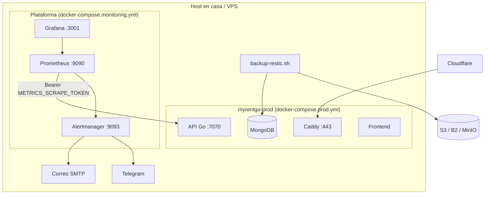

# Observabilidad y backup off-site — MyRent Go

Prometheus, Grafana, Alertmanager y Restic para producción en `rent.meincart.com`. Forman la capa de observabilidad **acoplada a MyRent Go** (red Docker `myrentgo-prod`), separada del compose de la aplicación.

Si necesitas el mismo tipo de servicios de forma **genérica / multi-app**, usa el kit [`ubuntu/platform/`](../ubuntu/README.md) (unidades independientes: Redis, MinIO, Vault, Prometheus, etc.). No levantes ambos stacks de monitoring en el mismo host sin necesidad.

## Arquitectura



| Componente | Compartido | Aislamiento MyRent Go |
|------------|------------|------------------------|
| Prometheus | Un stack por host | Label `app=myrentgo` |
| Alertmanager | Un stack por host | Rutas por `severity` y label `app` |
| Grafana | Un stack por host | Carpeta `MyRent Go - prod` |
| Restic | Un repositorio S3 | Tags `myrentgo`, `prod` |
| Red Docker | `myrentgo-prod` | Solo contenedores de esta app |

---

## Prometheus + Grafana

### Requisitos

- App en producción levantada (`./scripts/deploy-prod.sh`)
- Red Docker `myrentgo-prod` (creada automáticamente por `docker-compose.prod.yml`)
- `METRICS_SCRAPE_TOKEN` en `.env` de la app y en `deploy/platform/.env.monitoring`

### Paso 1 — Token de scrape

Genera un token y úsalo en **ambos** archivos:

```bash
openssl rand -base64 32
```

En `.env` (app):

```env
METRICS_PROTECTED=true
METRICS_SCRAPE_TOKEN=<token-generado>
```

En `deploy/platform/.env.monitoring`:

```env
METRICS_SCRAPE_TOKEN=<mismo-token>
GRAFANA_ADMIN_PASSWORD=<contraseña-fuerte>
```

La API acepta `/metrics` con:

- `Authorization: Bearer <METRICS_SCRAPE_TOKEN>` (Prometheus), o
- JWT de usuario **owner** / **admin** (humano en navegador).

### Paso 2 — Levantar monitoring

```bash
cp deploy/platform/.env.monitoring.example deploy/platform/.env.monitoring
chmod 600 deploy/platform/.env.monitoring
# Completar valores

./scripts/deploy-monitoring.sh
```

Reinicia la API si añadiste el token después del primer deploy:

```bash
docker compose -f docker-compose.prod.yml up -d api
```

### Paso 3 — Verificar

```bash
# Targets en Prometheus (debe aparecer myrentgo-api UP)
open http://127.0.0.1:9090/targets

# Grafana
open http://127.0.0.1:3001
# Dashboard: MyRent Go — Overview
```

### Métricas expuestas

| Métrica | Descripción |
|---------|-------------|
| `myrent_http_requests_total` | Peticiones HTTP por método, ruta y status |
| `myrent_http_request_duration_seconds` | Latencia |
| `myrent_mongodb_up` | 1 si MongoDB responde |
| `myrent_login_attempts_total` | Logins exitosos y fallidos |
| `myrent_scheduler_runs_total` | Ejecuciones de schedulers (correo, renovaciones) |
| `myrent_uptime_seconds` | Uptime del proceso API |

### Alertas incluidas

Archivo `deploy/platform/prometheus/alerts.yml`:

| Alerta | Condición |
|--------|-----------|
| `MyRentGoAPIDown` | Target de scrape caído 2 min |
| `MyRentGoMongoDBDown` | `myrent_mongodb_up == 0` |
| `MyRentGoHigh5xxRate` | Más del 5% de respuestas 5xx |
| `MyRentGoLoginFailures` | Más de 20 logins fallidos en 15 min |

### Alertmanager (correo y Telegram)

Incluido en `docker-compose.monitoring.yml`. Prometheus envía alertas a `alertmanager:9093`.

En `deploy/platform/.env.monitoring` configura **al menos uno**:

**Correo (Brevo, SendGrid, Gmail):**

```env
ALERTMANAGER_SMTP_HOST=smtp-relay.brevo.com
ALERTMANAGER_SMTP_PORT=587
ALERTMANAGER_SMTP_USER=<login-brevo>
ALERTMANAGER_SMTP_PASSWORD=<smtp-key>
ALERTMANAGER_SMTP_FROM=alerts@meincart.com
ALERTMANAGER_EMAIL_TO=admin@meincart.com
```

**Telegram (opcional):**

```env
ALERTMANAGER_TELEGRAM_BOT_TOKEN=<token-del-bot>
ALERTMANAGER_TELEGRAM_CHAT_ID=<chat-id-numerico>
```

Obtener `chat_id`: crea un bot con [@BotFather](https://t.me/BotFather), envíale un mensaje y consulta  
`https://api.telegram.org/bot<TOKEN>/getUpdates` — el campo `chat.id` es el valor.

Regenerar y aplicar:

```bash
./scripts/deploy-monitoring.sh
```

UI Alertmanager: http://127.0.0.1:9093 — revisa **Alerts** activas y **Silences**.

| Severidad | Receiver | Repetición |
|-----------|----------|------------|
| `warning` | `default` | cada 4 h |
| `critical` | `critical` | cada 1 h |

### Seguridad

- Prometheus, Alertmanager y Grafana escuchan solo en `127.0.0.1` (no accesibles desde Internet).
- Acceso remoto: túnel SSH (menú: [`./port-forward.sh`](../port-forward.sh) o manual)  
  `ssh -L 9090:127.0.0.1:9090 -L 9093:127.0.0.1:9093 -L 3001:127.0.0.1:3001 -p 2222 usuario@host`
- No desactives `METRICS_PROTECTED` en producción.

---

## Restic (backup off-site)

Complementa `scripts/backup-prod.sh` (backup local) subiendo el `.tar.gz` a almacenamiento S3-compatible.

### Flujo

1. `backup-prod.sh` — `mongodump` + documentos → `backups/myrent_prod_YYYYMMDD_HHMMSS.tar.gz`
2. `backup-restic.sh` — sube el archivo más reciente con Restic
3. `restic forget --prune` — retención configurable

### Paso 1 — Configurar destino

```bash
cp deploy/platform/restic.env.example deploy/platform/restic.env
chmod 600 deploy/platform/restic.env
```

Ejemplo **Backblaze B2**:

```env
RESTIC_REPOSITORY=s3:https://s3.us-west-004.backblazeb2.com/mi-bucket/myrentgo-restic
RESTIC_PASSWORD=<contraseña-repositorio-restic>
AWS_ACCESS_KEY_ID=<b2-key-id>
AWS_SECRET_ACCESS_KEY=<b2-application-key>
RESTIC_KEEP_DAILY=30
RESTIC_KEEP_WEEKLY=12
RESTIC_KEEP_MONTHLY=12
```

### Paso 2 — Inicializar repositorio (una vez)

```bash
RESTIC_INIT=1 ./scripts/backup-restic.sh
```

### Paso 3 — Backup manual

```bash
./scripts/backup-restic.sh
```

Verificación opcional de integridad:

```bash
RESTIC_CHECK=1 ./scripts/backup-restic.sh
```

### Paso 4 — Cron

```bash
crontab -e
# Backup local + off-site a las 03:30
30 3 * * * cd /opt/myrent && ./scripts/backup-restic.sh >> /var/log/myrent-restic.log 2>&1
```

### Restaurar desde Restic

```bash
# Listar snapshots
docker run --rm \
  -e RESTIC_REPOSITORY -e RESTIC_PASSWORD \
  -e AWS_ACCESS_KEY_ID -e AWS_SECRET_ACCESS_KEY \
  restic/restic:0.17.3 snapshots --tag myrentgo

# Restaurar último snapshot a ./restore
docker run --rm \
  -e RESTIC_REPOSITORY -e RESTIC_PASSWORD \
  -e AWS_ACCESS_KEY_ID -e AWS_SECRET_ACCESS_KEY \
  -v "$(pwd)/restore:/restore" \
  restic/restic:0.17.3 restore latest --tag myrentgo --target /restore
```

Luego extrae el `.tar.gz` y restaura MongoDB según [PRODUCTION.md](./PRODUCTION.md).

---

## Checklist producción

- [ ] `METRICS_SCRAPE_TOKEN` en `.env` y `.env.monitoring` (mismo valor)
- [ ] `./scripts/deploy-monitoring.sh` — targets UP en Prometheus
- [ ] Alertmanager configurado (correo y/o Telegram en `.env.monitoring`)
- [ ] Dashboard Grafana visible
- [ ] `deploy/platform/restic.env` configurado
- [ ] `RESTIC_INIT=1` ejecutado una vez
- [ ] Cron `backup-restic.sh` activo
- [ ] Restore probado al menos una vez en entorno de prueba

---

## Referencias

- [deploy/platform/README.md](../deploy/platform/README.md) — monitoring acoplado a MyRent Go (`myrentgo-prod`)
- [ubuntu/README.md](../ubuntu/README.md) — kit genérico (Prometheus/Grafana/Redis/MinIO/… independientes)
- [ubuntu/docs/CATALOGO.md](../ubuntu/docs/CATALOGO.md)
- [DIA1_PRODUCCION_APP_MEINCART.md](./DIA1_PRODUCCION_APP_MEINCART.md)
- [CHECKLIST_PRODUCCION.md](./CHECKLIST_PRODUCCION.md)
- [PRODUCTION.md](./PRODUCTION.md)
