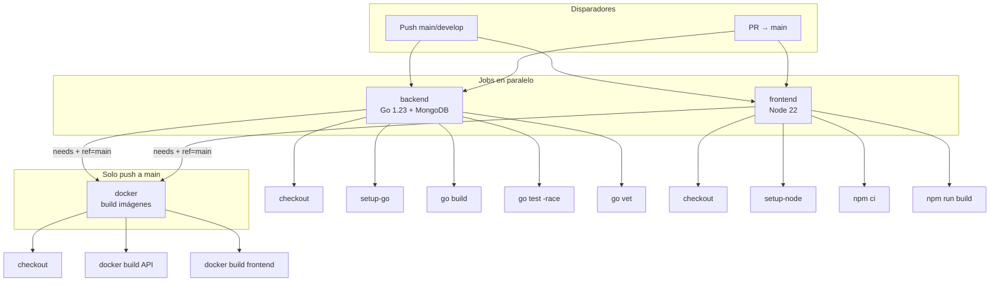

# GitHub Actions CI — MyRent Go

Guía paso a paso del pipeline de integración continua definido en [`.github/workflows/ci.yml`](../../.github/workflows/ci.yml). El CI valida backend (Go), frontend (React/Vite) e imágenes Docker en cada cambio relevante.

## Índice

| Documento | Contenido |
|-----------|-----------|
| Este archivo | Resumen, disparadores, diagrama y ejecución local |
| [workflow.md](./workflow.md) | Cada job y step explicado en detalle |
| [dockerfiles.md](./dockerfiles.md) | Dockerfiles backend/frontend, nginx, `.dockerignore` y Compose |
| [troubleshooting.md](./troubleshooting.md) | Fallos frecuentes y cómo corregirlos |

## Qué hace el CI

El workflow se llama **CI** y ejecuta tres jobs:

| Job | Cuándo corre | Propósito |
|-----|--------------|-----------|
| `backend` | Siempre (push/PR según reglas) | Compilar, probar y analizar el código Go |
| `frontend` | Siempre | Instalar dependencias y compilar la PWA |
| `docker` | Solo en **push a `main`**, y solo si `backend` y `frontend` pasan | Verificar que las imágenes Docker construyen correctamente |

Los jobs `backend` y `frontend` corren **en paralelo**. El job `docker` espera a ambos (`needs: [backend, frontend]`).

## Disparadores (triggers)

```yaml
on:
  push:
    branches: [main, develop]
  pull_request:
    branches: [main]
```

| Evento | Rama | Jobs que se ejecutan |
|--------|------|----------------------|
| **Push** | `main` | `backend`, `frontend`, `docker` |
| **Push** | `develop` | `backend`, `frontend` (no `docker`) |
| **Pull request** hacia `main` | cualquier rama origen | `backend`, `frontend` (no `docker`) |
| Push a otra rama (sin PR a `main`) | — | **No se ejecuta** |

### Implicaciones prácticas

- Trabajar en una feature branch sin abrir PR a `main` **no** dispara el CI hasta que hagas push a `develop`, push a `main`, o abras/actualices un PR hacia `main`.
- Las imágenes Docker solo se construyen en CI cuando el código llega a `main` por push directo. Los PR muestran el estado de `backend` y `frontend`, pero no validan el build Docker en GitHub Actions.
- No hay cron, tags ni despliegue automático en este workflow: solo verificación de build/test.

## Flujo del pipeline



## Resumen por job

Detalle completo en [workflow.md](./workflow.md).

### `backend`

- **Runner:** `ubuntu-latest`
- **Servicio:** contenedor `mongo:7` en el puerto `27017`
- **Go:** `1.23` (alineado con `backend/go.mod`)
- **Pasos:** checkout → setup-go → `go build ./...` → `go test ./... -race -coverprofile=coverage.out` → `go vet ./...`
- **Variables de entorno en tests:** `MONGODB_URI=mongodb://localhost:27017`, `MONGODB_DATABASE=myrent_test`

### `frontend`

- **Runner:** `ubuntu-latest`
- **Node:** `22` (alineado con `frontend/Dockerfile`)
- **Pasos:** checkout → setup-node → `npm ci` → `npm run build` (`tsc -b && vite build`)

### `docker`

- **Condición:** `if: github.ref == 'refs/heads/main'`
- **Pasos:** checkout → `docker build -t myrent-api:${{ github.sha }} ./backend` → `docker build -t myrent-frontend:${{ github.sha }} ./frontend`
- **Tags:** `myrent-api:${{ github.sha }}` y `myrent-frontend:${{ github.sha }}`
- **Nota:** las imágenes se construyen para validar los Dockerfiles; **no se publican** a un registry (no hay `docker push` ni secrets de Docker Hub/GHCR).
- **Documentación:** etapas multi-stage, healthchecks, nginx y `.dockerignore` en [dockerfiles.md](./dockerfiles.md).

## Secretos y variables

Este workflow **no usa** `secrets` ni `vars` de GitHub Actions. Toda la configuración necesaria está en el propio YAML o en variables `env` del step de tests.

| Variable | Dónde | Valor en CI |
|----------|-------|-------------|
| `MONGODB_URI` | Job `backend`, step Test | `mongodb://localhost:27017` |
| `MONGODB_DATABASE` | Job `backend`, step Test | `myrent_test` |
| `github.sha` | Job `docker`, tags de imagen | Commit SHA del push (automático) |

Los tests actuales son unitarios de dominio (`property`, `mortgage`); MongoDB está disponible por si se añaden tests de integración. La app en producción usa la misma imagen `mongo:7` que `docker-compose.prod.yml`.

## Relación con los Dockerfiles

Los Dockerfiles viven junto a cada servicio. El job `docker` los construye solo en push a `main`; `docker-compose.yml` y `docker-compose.prod.yml` usan los mismos contextos en local y producción.

| Imagen | Contexto | Dockerfile | Base / etapas |
|--------|----------|------------|---------------|
| API | `./backend` | `backend/Dockerfile` | `golang:1.23-alpine` → binario estático → `alpine:3.20` (puerto 7070, usuario no root) |
| Frontend | `./frontend` | `frontend/Dockerfile` | `node:22-alpine` (build) → `nginx:1.27-alpine` (SPA + proxy `/api/`) |

El CI de backend/frontend compila **sin Docker** (Go y npm en el runner). El job `docker` comprueba que el empaquetado multi-stage funciona con las mismas versiones (Go `1.23`, Node `22`).

Guía completa (etapas builder/runtime, `nginx.conf`, `.dockerignore`, comandos locales y producción): **[dockerfiles.md](./dockerfiles.md)**.

## Ejecutar localmente lo que hace el CI

### Backend (equivalente al job `backend`)

Requisitos: Go 1.23+, MongoDB opcional (los tests actuales no lo exigen).

```bash
# MongoDB (opcional, igual que en CI)
docker run -d --name mongo-ci -p 27017:27017 mongo:7

cd backend
go build ./...
MONGODB_URI=mongodb://localhost:27017 MONGODB_DATABASE=myrent_test \
  go test ./... -race -coverprofile=coverage.out
go vet ./...
```

Atajo con Makefile (sin `coverprofile` ni base de datos explícita):

```bash
make test    # go test ./... -v -race -cover
make lint    # incluye go vet en backend
```

### Frontend (equivalente al job `frontend`)

Requisitos: Node 22.

```bash
cd frontend
npm ci
npm run build
```

O desde la raíz:

```bash
make build-frontend
```

### Docker (equivalente al job `docker`)

Requisitos: Docker instalado.

```bash
docker build -t myrent-api ./backend
docker build -t myrent-frontend ./frontend
docker compose up -d --build
```

Stack de producción:

```bash
make docker-prod    # docker-compose.prod.yml
```

Más detalle: [dockerfiles.md](./dockerfiles.md#build-y-ejecución-local).

### Script todo-en-uno (simular CI completo en `main`)

```bash
#!/usr/bin/env bash
set -euo pipefail

cd backend && go build ./... && \
  MONGODB_URI=mongodb://localhost:27017 MONGODB_DATABASE=myrent_test \
  go test ./... -race -coverprofile=coverage.out && go vet ./...
cd ../frontend && npm ci && npm run build
cd .. && docker build -t myrent-api:local ./backend && docker build -t myrent-frontend:local ./frontend
echo "CI local OK"
```

## Qué no cubre el CI

| Aspecto | Estado |
|---------|--------|
| ESLint frontend (`npm run lint`) | No está en CI; disponible con `make lint` |
| Publicación de imágenes Docker | No |
| Despliegue a VPS / Cloudflare | No (ver [docs/Cloudflare](../Cloudflare/README.md)) |
| Tests E2E o contract tests | No |
| Subida de cobertura a Codecov | No (se genera `coverage.out` pero no se publica) |

## Referencias

- Workflow: [`.github/workflows/ci.yml`](../../.github/workflows/ci.yml)
- Dockerfiles: [dockerfiles.md](./dockerfiles.md), [`backend/Dockerfile`](../../backend/Dockerfile), [`frontend/Dockerfile`](../../frontend/Dockerfile), [`frontend/nginx.conf`](../../frontend/nginx.conf)
- Backend: [`backend/go.mod`](../../backend/go.mod)
- Frontend: [`frontend/package.json`](../../frontend/package.json)
- Compose producción: [`docker-compose.prod.yml`](../../docker-compose.prod.yml)
- Problemas habituales: [troubleshooting.md](./troubleshooting.md)
