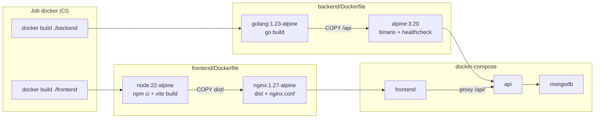

# Dockerfiles — MyRent Go

Referencia paso a paso de las imágenes Docker del proyecto: [`backend/Dockerfile`](../../backend/Dockerfile), [`frontend/Dockerfile`](../../frontend/Dockerfile) y [`frontend/nginx.conf`](../../frontend/nginx.conf). El job `docker` del CI ([`.github/workflows/ci.yml`](../../.github/workflows/ci.yml)) y los archivos `docker-compose*.yml` usan estos mismos contextos de build.

## Índice

| Sección | Contenido |
|---------|-----------|
| [Visión general](#visión-general) | Ubicación, imágenes y flujo multi-stage |
| [Backend (API Go)](#backend-api-go) | Etapas builder y runtime |
| [Frontend (React + Nginx)](#frontend-react--nginx) | Build Node y servidor estático |
| [nginx.conf](#nginxconf) | SPA, proxy API y WebSocket |
| [.dockerignore](#dockerignore) | Qué se excluye del contexto de build |
| [CI — job docker](#ci--job-docker) | Comandos y condiciones en GitHub Actions |
| [Build y ejecución local](#build-y-ejecución-local) | Comandos manuales y Compose |
| [Producción con Compose](#producción-con-compose) | `docker-compose.prod.yml` y Caddy |

---

## Visión general

MyRent Go empaqueta dos servicios en imágenes independientes:

| Imagen | Contexto | Dockerfile | Puerto expuesto | Base final |
|--------|----------|------------|-----------------|------------|
| `myrent-api` | `./backend` | `backend/Dockerfile` | `7070` | `alpine:3.20` |
| `myrent-frontend` | `./frontend` | `frontend/Dockerfile` | `80` | `nginx:1.27-alpine` |

Ambos Dockerfiles usan **build multi-stage**: una etapa de compilación (builder) y otra mínima de ejecución (runtime). El binario Go y los assets estáticos se copian a la imagen final; compiladores, código fuente y dependencias de desarrollo quedan fuera.



---

## Backend (API Go)

Archivo: [`backend/Dockerfile`](../../backend/Dockerfile)

### Etapa 1 — `builder`

```dockerfile
FROM golang:1.23-alpine AS builder
WORKDIR /app
RUN apk add --no-cache git ca-certificates
COPY go.mod go.sum ./
RUN go mod download
COPY . .
RUN CGO_ENABLED=0 GOOS=linux go build -ldflags="-s -w" -o /api ./cmd/api
```

| Paso | Propósito |
|------|-----------|
| `golang:1.23-alpine` | Imagen con Go 1.23; alineada con `backend/go.mod` y el job `backend` del CI |
| `git`, `ca-certificates` | Dependencias para módulos privados y TLS en `go mod download` |
| `COPY go.mod go.sum` + `go mod download` | Capa cacheable: solo se invalida si cambian dependencias |
| `COPY . .` | Código fuente del backend |
| `CGO_ENABLED=0 GOOS=linux` | Binario estático para Linux, sin libc de C |
| `-ldflags="-s -w"` | Reduce tamaño (strip debug symbols) |
| `-o /api ./cmd/api` | Punto de entrada HTTP de la API |

### Etapa 2 — runtime

```dockerfile
FROM alpine:3.20
RUN apk add --no-cache ca-certificates tzdata wget
WORKDIR /app
COPY --from=builder /api .
RUN adduser -D -g '' appuser && mkdir -p storage && chown appuser:appuser storage
USER appuser
EXPOSE 7070
HEALTHCHECK --interval=30s --timeout=3s CMD wget -qO- http://localhost:7070/health || exit 1
CMD ["./api"]
```

| Paso | Propósito |
|------|-----------|
| `alpine:3.20` | Imagen mínima (~5–10 MB más el binario) |
| `ca-certificates`, `tzdata` | HTTPS saliente y zonas horarias correctas |
| `wget` | Cliente HTTP para el healthcheck |
| `COPY --from=builder` | Solo el binario; no el toolchain Go |
| `appuser` (no root) | El proceso corre con usuario sin privilegios |
| `storage/` | Directorio para archivos subidos; montado como volumen en Compose |
| `EXPOSE 7070` | Puerto por defecto (`APP_PORT` en configuración) |
| `HEALTHCHECK` | Comprueba `GET /health` cada 30 s; usado por orquestadores y Compose |
| `CMD ["./api"]` | Arranque del servidor Gin |

La configuración (MongoDB, JWT, SMTP, etc.) llega por **variables de entorno** en runtime; no se bakea en la imagen.

---

## Frontend (React + Nginx)

Archivo: [`frontend/Dockerfile`](../../frontend/Dockerfile)

### Etapa 1 — `builder`

```dockerfile
FROM node:22-alpine AS builder
WORKDIR /app
COPY package.json package-lock.json* ./
RUN npm ci
COPY . .
RUN npm run build
```

| Paso | Propósito |
|------|-----------|
| `node:22-alpine` | Node 22 LTS; alineado con el job `frontend` del CI |
| `COPY package.json package-lock.json*` | Capa cacheable de dependencias |
| `npm ci` | Instalación reproducible desde el lockfile (falla si está desincronizado) |
| `npm run build` | Ejecuta `tsc -b && vite build` → salida en `dist/` |

### Etapa 2 — runtime

```dockerfile
FROM nginx:1.27-alpine
COPY nginx.conf /etc/nginx/conf.d/default.conf
COPY --from=builder /app/dist /usr/share/nginx/html
EXPOSE 80
HEALTHCHECK --interval=30s --timeout=3s CMD wget -qO- http://localhost/ || exit 1
```

| Paso | Propósito |
|------|-----------|
| `nginx:1.27-alpine` | Servidor web ligero para assets estáticos |
| `nginx.conf` | Routing SPA, proxy a la API y cabeceras de seguridad |
| `dist/` | Bundle de producción de Vite (HTML, JS, CSS, assets) |
| `HEALTHCHECK` | Comprueba que Nginx responde en el puerto 80 |

No hay Node ni código fuente en la imagen final: solo Nginx y archivos estáticos.

---

## nginx.conf

Archivo: [`frontend/nginx.conf`](../../frontend/nginx.conf). Se copia a `/etc/nginx/conf.d/default.conf` dentro del contenedor frontend.

### Routing SPA

```nginx
location / {
    try_files $uri $uri/ /index.html;
}
```

Las rutas del cliente (React Router) no existen como archivos en disco. Nginx intenta servir el archivo solicitado y, si no existe, devuelve `index.html` para que la SPA gestione la ruta.

### Proxy a la API

```nginx
location /api/ {
    proxy_pass http://api:7070;
    ...
}
```

Las peticiones del navegador a `/api/...` se reenvían al servicio **`api`** de Docker Compose (hostname interno `api`, puerto `7070`). El frontend y la API comparten el mismo origen desde el punto de vista del usuario cuando accede por el puerto del frontend.

### WebSocket

```nginx
location /ws {
    proxy_pass http://api:7070;
    proxy_http_version 1.1;
    proxy_set_header Upgrade $http_upgrade;
    proxy_set_header Connection "upgrade";
    ...
}
```

Conexiones WebSocket (notificaciones en tiempo real) se proxean al mismo backend con las cabeceras de upgrade necesarias.

### Cabeceras de seguridad

Se añaden en todas las respuestas:

- `X-Frame-Options: DENY`
- `X-Content-Type-Options: nosniff`
- `Referrer-Policy: strict-origin-when-cross-origin`

### Nota sobre producción

En `docker-compose.prod.yml`, **Caddy** termina TLS en el borde (`deploy/caddy/Caddyfile`). El contenedor frontend sigue sirviendo HTTP interno en el puerto 80; Caddy enruta el tráfico público hacia frontend y API según la configuración del reverse proxy.

---

## .dockerignore

Docker envía al daemon solo los archivos **no ignorados** del contexto de build. Excluir basura acelera el build, reduce el tamaño del contexto y evita filtrar secretos.

### Raíz — [`.dockerignore`](../../.dockerignore)

Usado si el contexto fuera la raíz del repo (p. ej. builds manuales desde `/`). Excluye:

| Patrón | Motivo |
|--------|--------|
| `.git`, `.github/` | Historial y CI; no necesarios en la imagen |
| `.env`, `.env.*` | Secretos locales |
| `**/node_modules`, `**/dist`, `**/bin` | Artefactos generados |
| `docs/`, `*.md`, `Prompt_*.md` | Documentación |
| `docker-compose*.yml`, `*.sh` | Orquestación y scripts de desarrollo |
| `deploy/` | Config de despliegue (Caddy, etc.) |

### Backend — [`backend/.dockerignore`](../../backend/.dockerignore)

Contexto `./backend` (el que usa CI y Compose):

| Patrón | Motivo |
|--------|--------|
| `bin/` | Binarios compilados en local |
| `storage/` | Datos de runtime; se montan como volumen |
| `*.md`, `.env*` | Docs y secretos |

### Frontend — [`frontend/.dockerignore`](../../frontend/.dockerignore)

Contexto `./frontend`:

| Patrón | Motivo |
|--------|--------|
| `node_modules/` | Se reinstalan con `npm ci` en el builder |
| `dist/` | Se regenera con `npm run build` |
| `.vite/` | Cache de desarrollo |
| `*.md`, `.env*` | Docs y secretos |

**Importante:** `nginx.conf`, `go.mod`, `go.sum` y `package-lock.json` **no** deben estar ignorados; el CI fallará con `COPY failed` si faltan.

---

## CI — job docker

Definido en [`.github/workflows/ci.yml`](../../.github/workflows/ci.yml):

```yaml
docker:
  runs-on: ubuntu-latest
  needs: [backend, frontend]
  if: github.ref == 'refs/heads/main'
  steps:
    - uses: actions/checkout@v4
    - name: Build API image
      run: docker build -t myrent-api:${{ github.sha }} ./backend
    - name: Build Frontend image
      run: docker build -t myrent-frontend:${{ github.sha }} ./frontend
```

| Aspecto | Detalle |
|---------|---------|
| **Cuándo corre** | Solo en **push a `main`**, y solo si `backend` y `frontend` pasaron |
| **Contextos** | `./backend` y `./frontend` (cada uno con su `.dockerignore`) |
| **Tags** | `myrent-api:<SHA>` y `myrent-frontend:<SHA>` para trazabilidad |
| **Publicación** | No hay `docker push`; solo valida que los Dockerfiles construyen |
| **Paridad** | Go 1.23 y Node 22 coinciden con los jobs nativos y con los Dockerfiles |

Los jobs `backend` y `frontend` compilan **sin Docker** en el runner. El job `docker` es una verificación adicional de empaquetado multi-stage.

Detalle del workflow: [workflow.md](./workflow.md#job-docker). Problemas habituales: [troubleshooting.md](./troubleshooting.md#job-docker).

---

## Build y ejecución local

### Construir imágenes manualmente

Equivalente al job `docker` del CI (con tags locales):

```bash
docker build -t myrent-api ./backend
docker build -t myrent-frontend ./frontend
```

Con tag explícito (como en CI):

```bash
docker build -t myrent-api:$(git rev-parse HEAD) ./backend
docker build -t myrent-frontend:$(git rev-parse HEAD) ./frontend
```

Forzar rebuild sin cache (útil al depurar capas):

```bash
docker build --no-cache -t myrent-api ./backend
docker build --no-cache -t myrent-frontend ./frontend
```

### Stack completo con Compose (desarrollo)

[`docker-compose.yml`](../../docker-compose.yml) construye y levanta MongoDB, API y frontend:

```bash
docker compose up -d --build
```

| Servicio | Build | Puertos host | Notas |
|----------|-------|--------------|-------|
| `mongodb` | Imagen `mongo:7` | `27017` | Volumen `mongodb_data` |
| `api` | `context: ./backend` | `7070` | Volumen `api_storage` → `/app/storage` |
| `frontend` | `context: ./frontend` | `3000→80` | Proxy `/api/` → `api:7070` |

Atajos Makefile desde la raíz:

```bash
make docker-up      # docker compose up -d --build
make docker-down    # docker compose down
```

### Verificar healthchecks

```bash
docker inspect --format='{{.State.Health.Status}}' myrent-api
docker inspect --format='{{.State.Health.Status}}' myrent-frontend
curl -s http://localhost:7070/health    # API directa
curl -s -o /dev/null -w "%{http_code}" http://localhost:3000/   # Frontend (dev compose)
```

---

## Producción con Compose

[`docker-compose.prod.yml`](../../docker-compose.prod.yml) reutiliza **los mismos Dockerfiles** con configuración orientada a producción:

```yaml
api:
  build:
    context: ./backend
    dockerfile: Dockerfile
  environment:
    APP_ENV: production
    JWT_SECRET: ${JWT_SECRET}
    CORS_ORIGINS: ${CORS_ORIGINS}
    FRONTEND_URL: ${FRONTEND_URL}
    MFA_ENABLED: "true"
    RATE_LIMIT_RPS: "20"
  deploy:
    replicas: 2
    resources:
      limits:
        memory: 512M

frontend:
  build:
    context: ./frontend
    dockerfile: Dockerfile
  ports:
    - "80:80"
    - "443:443"
```

| Diferencia vs desarrollo | Producción |
|--------------------------|------------|
| Variables sensibles | Desde `.env` (`JWT_SECRET`, `CORS_ORIGINS`, …) |
| API | 2 réplicas, límites de memoria |
| Frontend | Puertos 80/443 expuestos |
| TLS / dominio | **Caddy** (`deploy/caddy/Caddyfile`) delante de frontend y API |
| MongoDB | Sin puerto publicado al host; solo red interna |

Levantar stack de producción:

```bash
# Configurar .env con JWT_SECRET, CORS_ORIGINS, FRONTEND_URL, SMTP_*, etc.
docker compose -f docker-compose.prod.yml up -d --build
# o:
make docker-prod
```

Flujo típico en VPS:

1. CI valida builds en push a `main`.
2. En el servidor: `git pull` + `docker compose -f docker-compose.prod.yml up -d --build`.
3. Caddy obtiene certificados Let's Encrypt y enruta tráfico HTTPS.
4. Cloudflare (opcional) protege DNS y CDN — ver [docs/Cloudflare](../Cloudflare/README.md).

---

## Referencias

| Recurso | Ubicación |
|---------|-----------|
| CI workflow | [`.github/workflows/ci.yml`](../../.github/workflows/ci.yml) |
| Detalle jobs CI | [workflow.md](./workflow.md) |
| Fallos Docker en CI | [troubleshooting.md](./troubleshooting.md) |
| Compose desarrollo | [`docker-compose.yml`](../../docker-compose.yml) |
| Compose producción | [`docker-compose.prod.yml`](../../docker-compose.prod.yml) |
| Manual técnico | [`docs/MANUAL_TECNICO.md`](../MANUAL_TECNICO.md) |
| Despliegue / Cloudflare | [`docs/Cloudflare/README.md`](../Cloudflare/README.md) |
